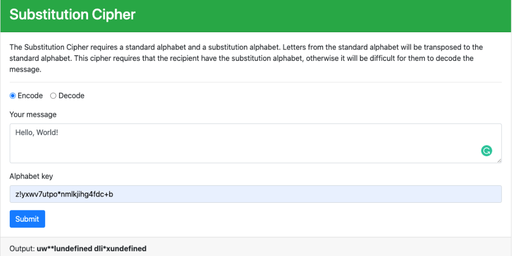

# Decoder Ring

## Link

[Decoder Ring Link](https://meleciosilva.github.io/project-decoder-ring)

## Description

Decoder Ring allows users to encode or decode messages using the Caesar's Shift, Polybius Square, and Substitution ciphers.

## Getting Started

### Caesar Shift

The Caesar Shift cipher can encode or decode a message by "shifting" the letters in a message left or right, based on the typical alphabet order. Special characters will not be shifted, only letters.

1. Select whether you would like to encode or decode a message
2. Enter a message
3. Input a shift number (negative values shift left and positive values shift right)

### Polybius Square

The Polybius Square cipher can encode or decode a message according to a specific coordinate-based grid of numbers and letters. Special characters will not be encoded or decoded, only numbers and letters.

1. Select whether you would like to encode or decode a message
2. Enter a message

### Substitution cipher

The Substitution cipher requires a substitution alphabet to be transposed with the standard alphabet. The order of the letters in each alphabet correspond with one another.

1. Select whether you would like to encode or decode a message
2. Enter a message
3. Enter an alphabet key of exactly 26 characters

## Technology

- Built using JavaScript
- Implemented unit tests using Mocha and Chai to ensure functionality and minimize bug development
- Created several helper functions to modulate code and improve readability
